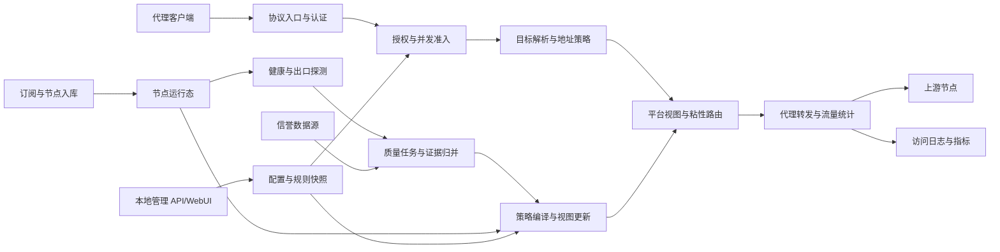

# Prism 项目总设计 v2

日期：2026-09-05。状态：个人开源版实现基线 v2.1；方案已整理，应用代码与容量验收尚未实施。

> 当前范围固定为个人自用与开源发行，不实现 SaaS、套餐、支付和多租户。个人版的分组、容量、检测和换 IP 方案见[实施总方案](plan/PRISM_PLAN_FULL.md)与[方案索引](plan/README.md)。

## 1. 目标与范围

Prism 是个人自用的代理资源管理与质量检测工具：导入不同来源和格式的节点，确认实际出口，持续检测并分类，通过自建 Platform 规则提供与 Resin 兼容的代理接入。项目以可审计、可复现和可长期维护的开源单机部署为目标。

性能与安全为同等优先的验收条件：安全检查不能因优化被绕过；安全机制应采用有界、可测量的实现，避免外部查询和全量扫描进入转发请求路径。资源不足时按明确策略拒绝或降载。

容量按用户实际场景确定：10 万库存为常规验收，30 万为峰值回归，100 万仅做可选冷库存压力测试。数值不是导入硬上限，也不代表同等数量的常驻 Outbound、并发连接或高频检测能力；活跃数量和周期按本机资源预算配置。

本版包含：

1. 继承 Resin 的 HTTP 正向代理、CONNECT、SOCKS5 CONNECT、HTTP 反向代理、WebSocket 转发能力。
2. 保留订阅解析、节点去重、P2C 调度、出口 IP 粘性租约、健康检查、持久化恢复。
3. 内置出口类型、信誉与黑名单检测，支持质量评级、时效、来源和历史记录。
4. 每个平台独立按 Resin 标签规则、订阅范围、手动分类、地区、出口类型、评级和证据有效期筛选节点。
5. 建设访问日志、检测记录和操作审计，流量统计只用于诊断。
6. 提供个人管理页面与 API；支持同出口线路分组、优先级和受控会话换 IP。

本版不包含：rpure 代码合并、自研代理协议栈、默认 UDP ASSOCIATE、通用插件执行平台、无输入限制的导入、代理进程跨机器透明迁移。HTTP/3 入站和跨区域自动续接现有 TCP 会话不作为首版承诺。

“住宅”“高信誉”“目标可访问”是独立属性。评级是指定数据源和规则下的判断，不承诺所有目标网站可用，不把未检测解释为低风险。

## 2. 当前证据与继承结论

当前主项目已包含迁出的 Go 应用及独立管理前端，原参考副本保留在 `references/Resin/`。Resin 的转发、租约、平台视图、探测队列和存储已被继承，新增质量检测和容量改造仍待实施。历史检查支持局部扩展，不以新增检测为由整体重写代理核心。

2026-09-05 已运行以下七个包的现有普通测试并通过：

```sh
go test ./internal/proxy ./internal/routing ./internal/probe \
  ./internal/topology ./internal/platform ./internal/requestlog ./internal/state
```

执行位置为 `references/Resin/`，使用 Go 1.27.0；参考模块声明 Go 1.25.5、sing-box v1.12.21。未完成 race、真实供应节点、全构建标签、规模和长时间稳定性验证。正式构建版本由 M0 验证后锁定，不以运行环境版本自动升级依赖。

继承的是协议实现、并发语义和现有行为测试。节点库存持久化、有界 Outbound 生命周期、出口组索引和增量视图需要局部改造；不能原样迁移全量常驻运行态后宣称达到新容量目标。

| 参考模块 | 决策 | 必要改造 |
|---|---|---|
| `proxy`, `outbound` | 保留实现主体 | 注入本地凭证、目的地址策略、连接上下文 |
| `routing`, `node`, `topology` | 保留模型和调度算法 | 平台 ID、质量版本检查、变更合并 |
| `probe` | 保留健康探测 | 可替换出口探测源、与付费质量查询隔离 |
| `platform` | 保留可路由视图 | 质量准入、时效检查、策略版本、解释接口 |
| `state` | 保留单写和恢复原则 | 新增质量、分组、切换状态迁移，区分权威数据与缓存 |
| `requestlog`, `metrics` | 保留可观测能力 | 脱敏、丢弃指标和本地留存策略 |
| `api`, `service`, WebUI | 渐进扩展 | 个人管理员鉴权；先最小运维页面，后完整页面 |

源码依据来自上游 Resin 仓库（基线提交见[上游基线](UPSTREAM_BASELINE.md)）：`internal/platform/platform.go`（平台筛选）、`internal/routing/router.go`（路由）、`internal/probe/manager.go`（探测）、`internal/proxy/counting_conn.go`（流量统计）、`internal/requestlog/service.go`（日志写入）。

## 3. 架构约束

| 编号 | 必须成立的约束 |
|---|---|
| INV-01 | 代理流量经过同一套认证、平台规则、目标策略和连接控制，所有协议及直连分支一致 |
| INV-02 | 路由请求不查询数据库或外部信誉 API，不做节点全量扫描或动态正则编译 |
| INV-03 | 已过期证据、旧出口证据和旧策略视图不能满足严格质量准入 |
| INV-04 | 网络健康与质量状态独立；检测服务故障不等价于节点故障 |
| INV-05 | 每个队列、缓存、工作池、输入和持久化积压都有容量与超限动作 |
| INV-06 | 管理员、平台、凭证、会话是不同概念，代理客户端不能覆盖服务端解析结果 |
| INV-07 | 访问日志和全局指标用于诊断，不作为安全或质量准入的唯一真源 |
| INV-08 | 鉴权过期、存储失效或质量状态未知时不得自动放行不安全路径 |
| INV-09 | 配置、评级、分组和检测任务都有版本或唯一标识，支持追踪和幂等 |
| INV-10 | 未经验证的性能数字仅作为目标，不出现在产品容量承诺中 |

## 4. 逻辑架构



该图表示进程内职责，不要求每个框是独立服务。出口探测通过被测节点，常规质量查询由后台按已确认 IP 请求来源；仅能查询访问者 IP 的来源按专用适配器处理，遵守来源配额和密钥边界。

### 4.1 部署形态

| 阶段 | 运行形态 | 数据归属 |
|---|---|---|
| 个人版 | 单个 `prism run` 进程（`bin/prism` 无子命令即启动），同进程独立工作池 | 本地 SQLite 保存配置、质量证据、运行缓存和滚动日志 |
| 可选高级部署 | 单机多个进程或只读分析工具 | 仍由一个 Prism 进程拥有写入权；不保证跨机器状态同步 |

默认部署不依赖 Redis、Kafka、PostgreSQL、etcd 或 Kubernetes。项目约定每个数据目录只有一个 Prism 写进程，每库一个 writer；这不是 SQLite 自身不支持多个进程。state.db 可靠保存配置、节点库存与质量证据，cache.db 仅保存可重建运行快照，metrics.db 和 request_logs 分别保存统计与滚动日志。

Prism 是**单端口**服务：`PRISM_LISTEN_ADDRESS`（默认 `127.0.0.1`）与 `PRISM_PORT`（默认 `2260`）上的同一个 listener 同时提供 `/ui/` 管理面板、`/api/v1/` 接口、HTTP/SOCKS5 正向代理、`/<token>/...` 反向代理与 `/sub/{token}` 订阅入口。可选的管理面通过 `PRISM_ADMIN_LISTEN` 单独开放，默认关闭且必须是 loopback。`PRISM_ADMIN_TOKEN` / `PRISM_PROXY_TOKEN` 从 `.env` 读取，不打包进前端。前端开发服务器（`npm run dev`）另有自己的端口与 `PRISM_API_TARGET` 反代目标，那只用于本地开发，不是产品部署形态。配置、库存、质量及缓存通过 StateEngine 编排到所属仓储；指标与日志独立排队写入，不因日志积压阻塞配置。

### 4.2 模块与依赖

| 模块 | 单一职责 | 可依赖的能力 |
|---|---|---|
| `identity` | 验证本地凭证，产生可信请求身份 | 本地凭证存储、令牌验证器 |
| `access` | 平台、协议、来源和目标准入 | Principal、已编译规则和并发接口 |
| `proxy` | 协议解析、转发和连接上下文 | access、targetpolicy、routing、outbound 接口 |
| `targetpolicy` | 规范化目标、解析与连接地址检查 | 受控解析器、只读规则 |
| `node`, `topology` | 节点状态、订阅引用、出口映射 | 事件回调、质量快照读取接口 |
| `probe` | 网络健康、出口观测 | 节点拨号接口、健康更新接口 |
| `inspection` | 质量任务、限流、预算、数据源调用 | quality、Provider、持久化任务接口 |
| `quality` | 证据归并、评级、有效性判断 | 标准数据类型、只读版本化规则 |
| `platform`, `policy` | 编译规则、构建候选视图和解释结果 | 节点与质量快照 |
| `routing` | P2C、租约、同 IP 轮换 | 授权后的平台 ID、候选视图、运行态 |
| `requestlog`, `metrics` | 访问日志、流量/连接统计和聚合指标 | 专属存储适配器，不修改代理状态；不增加重复的 usage 模块 |
| `audit` | 业务变更和操作证据 | 调用方事务、审计仓储 |
| `service`, `api` | 用例编排、输入输出与权限边界 | 模块公开接口，不直接改内部集合 |
| `state` | 配置事务、迁移、快照与恢复 | 数据库驱动；不发起代理请求 |
| `app` | 初始化、依赖注入、启停顺序 | 上述模块，不承载领域规则 |

接口由使用方定义，使用 Go 构造函数注入。保留现有包边界；只有出现新职责时新增包，不统一改名和搬迁全部旧代码。禁止循环依赖、可变全局服务定位器，以及一个通用事件总线承载所有一致性等级的数据。

所有模块只通过所有者的公开方法修改状态。数据库事务由用例层协调，写入经过对应仓储；代理热路径不持有数据库句柄。普通通知允许合并，安全失效必须另有实时检查保证，配置与审计事件必须可靠持久化。

### 4.3 目标目录

以下是目标结构，未标记为已经存在：

```text
cmd/prism/                 # standalone 子命令
internal/app/              # 组装、生命周期、配置校验
internal/proxy/            # 继承协议入口和转发
internal/outbound/         # sing-box 适配和资源生命周期
internal/node/             # 节点状态
internal/topology/         # 订阅、节点、平台关系
internal/probe/            # 健康与出口探测
internal/inspection/       # 质量任务、provider 适配
internal/quality/          # 证据、评级与有效性
internal/platform/         # 可路由视图
internal/policy/           # 质量规则编译
internal/routing/          # P2C 与租约
internal/identity/         # 可信身份
internal/access/           # 授权、准入
internal/targetpolicy/     # 目的地址控制
internal/audit/            # 变更审计
internal/requestlog/       # 请求诊断记录
internal/metrics/          # 聚合指标
internal/state/            # 配置、迁移和恢复
internal/service/          # 应用用例
internal/api/              # API DTO、校验、路由
web/                       # 个人管理端
api/openapi/               # 从首个 API 版本起维护的契约
tests/                     # 集成、跨协议、安全、性能场景
docs/                      # 当前设计及决策
references/Resin/          # 只读参考基线
```

## 5. 请求上下文与关键流程

认证后构造不可由客户端覆盖的请求身份：`credential_id`、凭证范围、凭证版本和有效期。随后构造请求上下文：`request_id`、授权后的 `platform_id`、受限 `session_key`、协议、规范化目标和服务端生成的流量类别。

租约按平台和会话命名空间隔离。平台 UUID 全局唯一，平台名称只用于入口解析；客户端不能通过未授权的平台名称取得其他平台的路由池。

```text
读取有限的握手/请求头
  -> 验证凭证、范围与有效期
  -> 解析并授权平台、协议、并发
  -> 验证目标与解析结果
  -> 本地并发与速率准入
  -> 租约或出口组 P2C 拾取，组内选择合格优先线路
  -> 检查候选当前版本与资格，建立上游并增量统计
  -> 连接结束，释放并发、提交统计增量、输出诊断日志
```

无论随机路由、粘性命中、同 IP 轮换还是代理绕过规则，都执行相同的凭证、平台和目标策略。个人版默认关闭直连绕过；受控例外仍执行地址策略和日志记录。

## 6. 故障时的统一规则

| 故障 | 动作 |
|---|---|
| 质量服务超时、429、配额不足 | 保留尚未过期证据，退避；严格平台排除无有效证据出口 |
| 平台候选为空 | 返回 `NO_ELIGIBLE_NODE`，不降级到未授权或低质量资源 |
| 配置变更队列积压 | 路由最终检查版本和有效期；不依赖事件已及时处理 |
| 管理 API 暂时不可用 | 已加载的本地配置继续运行；配置有效性无法确认时拒绝写入，不放宽代理策略 |
| 普通访问日志队列满 | 按配置丢弃并计数告警，不影响代理；检测和审计记录不能静默伪造成功 |
| 审计写入失败 | 对需要审计的管理变更回滚并返回错误 |
| 检测队列满或外部来源限流 | 保留旧证据到有效期；到期后按平台策略排除，不阻塞代理请求 |
| 进程崩溃 | 恢复权威配置、校验质量证据、重建分组和平台视图；未证实的状态不能放宽 |

具体超时、容量和数据边界见性能、安全及数据文档，不能在不同模块自行定义另一套默认值。

## 7. 已确定的工程决策

| 决策 | 取舍与原因 |
|---|---|
| ADR-01 保留 Resin 核心 | 避免重写已有协议边界与并发语义，新增需求通过接口扩展 |
| ADR-02 内置质量模块 | 与节点生命周期直接协作，独立预算和故障隔离，消除外部脚本同步 |
| ADR-03 证据按 IP、健康按节点与出口观测 | 共享信誉查询成本，保留不同线路的健康差异 |
| ADR-04 硬准入后再调度 | 信誉不能被低延迟评分抵消，P2C 只比较已合格候选 |
| ADR-05 单机优先、单写 SQLite | 保持个人部署简单，用分层运行态解决库存规模；不把数据库当作热路径缓存 |
| ADR-06 高熵本地代理密钥与有状态会话 | 易于自用客户端接入和撤销；JWT 不作为默认依赖 |
| ADR-07 流量统计独立于访问日志 | 支持连接复用和长隧道；日志可按策略抽样或滚动 |
| ADR-08 性能与安全共同设发布门槛 | 同一构建必须同时通过协议、隔离、恢复、容量和安全检查 |
| ADR-09 10 万常规、30 万峰值、百万冷库存 | 分开库存、内存与检测能力；不同档位独立给出实测数据 |
| ADR-10 节点库存与证据可靠持久化 | 源订阅离线或缓存丢失后仍可恢复已导入资源；同订阅多标签完整保留 |
| ADR-11 出口分组不合并来源实体 | 先按平台规则筛线路，再按独立 IP 分组，优先级不能绕过筛选 |

设计变更涉及上述约束、协议认证、数据库归属、检测口径或失效策略时，必须修改对应文档、迁移和验收用例，不能仅修改前端表单。

## 8. 专项文档与落地顺序

`docs/design/` 下的旧专项文档已删除（该目录当前被 `.gitignore` 忽略），对应内容现在由 `docs/plan/` 的工作包维护：

- [数据源、经节点检测与解锁检测](plan/09-intel-providers-checks.md)、[纯净度评估与平台质量准入](plan/10-purity-policy.md)：证据、评级、任务、准入与租约。
- [安全与回归整改](plan/04-regressions-security.md) 与[当前安全控制清单](SECURITY.md)：信任边界、认证、目标地址、密钥和故障安全。
- [实施总方案](plan/PRISM_PLAN_FULL.md)：个人版的容量边界、分组、检测调度和换 IP 方案。
- [持久化层重建与迁移](plan/02-state-layer.md)：数据表、写入语义、留存、备份和恢复。
- [端到端测试、文档与发布](plan/13-testing-release-docs.md)：容量预算、测试门槛和发布流程。
- [前端改造](plan/12-frontend.md)：个人管理员 API、导入、平台、检测和切换界面。
- [全局约束与已核实事实](plan/00-overview.md)：从 Resin 基线到开源发布的完整实施计划。

具体信誉供应商在 M2 接入前以真实样本确认覆盖、质量、许可和费用。开源基础模式不依赖付费服务：提供连通性、延迟、出口和可用 GeoIP；住宅/机房与信誉无证据时明确未知。不得将基础模式包装成已验证纯净度。
