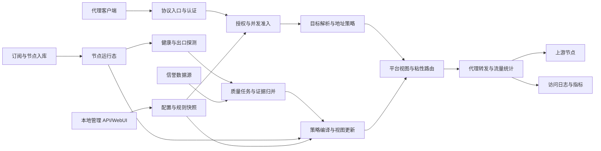

# Prism 项目总设计 v2

日期：2026-09-05（结构按当前代码复核 2026-09-30）。状态：个人开源版实现基线 v2.1；主体应用代码、检测子系统与容量测试均已在仓库中实现，本文按现有代码校准，不再描述"目标结构"。

> 当前范围固定为个人自用与开源发行，不实现 SaaS、套餐、支付和多租户。分组、容量、检测与换 IP 的现行行为见 [INTEL.md](INTEL.md)、[PERFORMANCE.md](PERFORMANCE.md) 与 [DESIGN.md 第 4 节](#4-逻辑架构)。

## 1. 目标与范围

Prism 是个人自用的代理资源管理与质量检测工具：导入不同来源和格式的节点，确认实际出口，持续检测并分类，通过自建 Platform 规则提供与 Resin 兼容的代理接入。项目以可审计、可复现和可长期维护的开源单机部署为目标。

性能与安全为同等优先的验收条件：安全检查不能因优化被绕过；安全机制应采用有界、可测量的实现，避免外部查询和全量扫描进入转发请求路径。资源不足时按明确策略拒绝或降载。

容量按用户实际场景确定：10 万库存为常规验收，30 万为峰值回归，100 万仅做可选冷库存压力测试。数值不是导入硬上限，也不代表同等数量的常驻 Outbound、并发连接或高频检测能力；活跃数量和周期按本机资源预算配置。

本版包含：

1. 继承 Resin 的 HTTP 正向代理、CONNECT、SOCKS5 CONNECT、HTTP 反向代理、WebSocket 转发能力。
2. 保留订阅解析、节点去重、P2C 调度、出口 IP 粘性租约、健康检查、持久化恢复。
3. 内置出口类型、信誉与黑名单检测，支持质量评级、时效、来源和历史记录。
4. 每个平台独立按 Resin 标签规则、订阅范围、手动分类、地区、出口类型、评级和证据有效期筛选节点。
5. 建设访问日志、检测记录和操作审计，流量统计只用于诊断。
6. 提供个人管理页面与 API；支持同出口线路分组、优先级和受控会话换 IP。

本版不包含：rpure 代码合并、自研代理协议栈、默认 UDP ASSOCIATE、通用插件执行平台、无输入限制的导入、代理进程跨机器透明迁移。HTTP/3 入站和跨区域自动续接现有 TCP 会话不作为首版承诺。

“住宅”“高信誉”“目标可访问”是独立属性。评级是指定数据源和规则下的判断，不承诺所有目标网站可用，不把未检测解释为低风险。

## 2. 当前证据与继承结论

> **本节是 2026-09-05 的 M0 基线的历史记录**，不是待办清单。下文"需要局部改造""必要改造"描述的是当时评估出的工作量；这些改造此后已经落地，当前结构见 §4。阅读时以 §3 的约束和 §4 的现状为准。

当前主项目已包含迁出的 Go 应用及独立管理前端；原参考副本位于本地私有目录 `references/Resin/`（`.gitignore` 忽略，不属于仓库）。Resin 的转发、租约、平台视图、探测队列和存储已被继承。本节早期写作"新增质量检测和容量改造仍待实施"，现已落地：质量检测子系统在 `internal/intel` 与独立 `intel.db`，容量测试为 `make capacity`，实测结果记录在 [PERFORMANCE.md](PERFORMANCE.md)。

2026-09-05 已运行以下七个包的现有普通测试并通过：

```sh
go test ./internal/proxy ./internal/routing ./internal/probe \
  ./internal/topology ./internal/platform ./internal/requestlog ./internal/state
```

执行位置为 `references/Resin/`，使用 Go 1.27.0；参考模块声明 Go 1.25.5、sing-box v1.12.21。当时的验证未覆盖真实供应节点、全构建标签、规模和长时间稳定性；race 此后已纳入 `make verify` 并在 CI 中运行。正式构建版本由 M0 验证后锁定，不以运行环境版本自动升级依赖。

继承的是协议实现、并发语义和现有行为测试。节点库存持久化、有界 Outbound 生命周期、出口组索引和增量视图需要局部改造；不能原样迁移全量常驻运行态后宣称达到新容量目标。

| 参考模块 | 决策 | 必要改造 |
|---|---|---|
| `proxy`, `outbound` | 保留实现主体 | 注入本地凭证、目的地址策略、连接上下文 |
| `routing`, `node`, `topology` | 保留模型和调度算法 | 平台 ID、质量版本检查、变更合并 |
| `probe` | 保留健康探测 | 可替换出口探测源、与付费质量查询隔离 |
| `platform` | 保留可路由视图 | 质量准入、时效检查、策略版本、解释接口 |
| `state` | 保留单写和恢复原则 | 新增质量、分组、切换状态迁移，区分权威数据与缓存 |
| `requestlog`, `metrics` | 保留可观测能力 | 脱敏、丢弃指标和本地留存策略 |
| `api`, `service`, WebUI | 渐进扩展 | 个人管理员鉴权；先最小运维页面，后完整页面 |

源码依据来自上游 Resin 仓库（基线提交见[上游基线](UPSTREAM_BASELINE.md)）：`internal/platform/platform.go`（平台筛选）、`internal/routing/router.go`（路由）、`internal/probe/manager.go`（探测）、`internal/proxy/counting_conn.go`（流量统计）、`internal/requestlog/service.go`（日志写入）。

## 3. 架构约束

| 编号 | 必须成立的约束 |
|---|---|
| INV-01 | 代理流量经过同一套认证、平台规则、目标策略和连接控制，所有协议及直连分支一致 |
| INV-02 | 路由请求不查询数据库或外部信誉 API，不做节点全量扫描或动态正则编译 |
| INV-03 | 已过期证据、旧出口证据和旧策略视图不能满足严格质量准入 |
| INV-04 | 网络健康与质量状态独立；检测服务故障不等价于节点故障 |
| INV-05 | 每个队列、缓存、工作池、输入和持久化积压都有容量与超限动作 |
| INV-06 | 管理员、平台、凭证、会话是不同概念，代理客户端不能覆盖服务端解析结果 |
| INV-07 | 访问日志和全局指标用于诊断，不作为安全或质量准入的唯一真源 |
| INV-08 | 鉴权过期、存储失效或质量状态未知时不得自动放行不安全路径 |
| INV-09 | 配置、评级、分组和检测任务都有版本或唯一标识，支持追踪和幂等 |
| INV-10 | 未经验证的性能数字仅作为目标，不出现在产品容量承诺中 |

## 4. 逻辑架构


```mermaid
flowchart LR
  Client[代理客户端] --> Ingress[协议入口与认证]
  Ingress --> Access[授权与并发准入]
  Access --> Target[目标解析与地址策略]
  Target --> Router[平台视图与粘性路由]
  Router --> Relay[代理转发与流量统计]
  Relay --> Upstream[上游节点]
  Relay --> Obs[访问日志与指标]
  Import[订阅与节点入库] --> Pool[节点运行态]
  Pool --> Health[健康与出口探测]
  Health --> Quality[质量任务与证据归并]
  Providers[信誉数据源] --> Quality
  Quality --> Policy[策略编译与视图更新]
  Pool --> Policy
  Policy --> Router
  Control[本地管理 API/WebUI] --> Config[配置与规则快照]
  Config --> Access
  Config --> Policy
```

该图表示进程内职责，不要求每个框是独立服务。出口探测通过被测节点，常规质量查询由后台按已确认 IP 请求来源；仅能查询访问者 IP 的来源按专用适配器处理，遵守来源配额和密钥边界。

### 4.1 部署形态

| 阶段 | 运行形态 | 数据归属 |
|---|---|---|
| 个人版 | 单个 `prism run` 进程（`bin/prism` 无子命令即启动），同进程独立工作池 | 本地 SQLite 保存配置、质量证据、运行缓存和滚动日志 |
| 可选高级部署 | 单机多个进程或只读分析工具 | 仍由一个 Prism 进程拥有写入权；不保证跨机器状态同步 |

默认部署不依赖 Redis、Kafka、PostgreSQL、etcd 或 Kubernetes。项目约定每个数据目录只有一个 Prism 写进程，每库一个 writer；这不是 SQLite 自身不支持多个进程。数据归属是分库的：**state.db** 保存配置（`system_config`、`platforms`、`subscriptions`（含订阅源文本 `content`，是节点库存的重建来源）、`account_header_rules`、`endpoints`、`export_profiles`、`intel_provider_settings`）与变更审计（`audit_log`）；**cache.db** 保存由订阅重建出来的节点库存（`nodes_static`、`nodes_dynamic`、`node_latency`、`subscription_nodes`）与租约（`leases`），即"可重建"的运行快照；检测证据在独立的 **intel.db**（`egress_history`、`evidence`、`ip_assessment`、`node_egress`、`node_checks` 与任务/provider 状态）；`metrics.db` 与滚动库 `request_logs-<unix_ms>.db` 位于日志目录（`PRISM_LOG_DIR`），既不在 state 目录、也不在备份清单允许范围内。

**"可重建"已核实成立**：节点进入池的唯一路径是 `GlobalNodePool.AddNodeFromSub`，其调用者全部在 `internal/topology/subscription_scheduler.go`（订阅刷新），没有手工加节点的接口；节点来源文本存在 state.db 的 `subscriptions.content` 里。因此删除 cache.db 只会丢掉可从订阅重新拉取的节点库存、延迟记录与租约——`prism import-resin` 也把 state.db（含 `subscriptions`）与 cache.db 一起搬，不构成例外。运维文档可以据此承诺"cache.db 可删"。

Prism 是**单端口**服务：`PRISM_LISTEN_ADDRESS`（默认 `127.0.0.1`）与 `PRISM_PORT`（默认 `2260`）上的同一个 listener 同时提供 `/ui/` 管理面板、`/api/v1/` 接口、HTTP/SOCKS5 正向代理、`/<token>/...` 反向代理与 `/sub/{token}` 订阅入口。可选的管理面通过 `PRISM_ADMIN_LISTEN` 单独开放，默认关闭且必须是 loopback。`PRISM_ADMIN_TOKEN` / `PRISM_PROXY_TOKEN` 从 `.env` 读取，不打包进前端。前端开发服务器（`npm run dev`）另有自己的端口与 `PRISM_API_TARGET` 反代目标，那只用于本地开发，不是产品部署形态。配置、库存、质量及缓存通过 StateEngine 编排到所属仓储；指标与日志独立排队写入，不因日志积压阻塞配置。

### 4.2 模块与依赖

| 模块 | 单一职责 |
|---|---|
| `config` | 环境变量配置加载与运行期配置模型 |
| `model` | 跨持久化层共享的领域结构体 |
| `state` | 配置事务、迁移、快照与恢复；SQLite 仓储、StateEngine 与脏集刷盘 |
| `addrpolicy` | 目的地址控制：判定一个节点目标是否可接受（原设计中的 `targetpolicy`） |
| `netutil` | 受控解析与下载辅助：域名提取、响应体与下载上限 |
| `node` | 节点文档格式、能力与哈希 |
| `subscription` | 订阅类型与解析 |
| `topology` | 订阅 → 节点池 → 平台视图的编排，打破 node / subscription / platform 之间的导入环 |
| `platform` | 平台、节点条件、质量策略与规则编译，构建可路由视图并给出排除原因（原设计中的 `access`／`policy`） |
| `proxy` | 协议入口与转发、可信请求身份与准入（原设计中的 `identity`） |
| `outbound` | sing-box 出口适配和资源生命周期 |
| `probe` | 网络健康与出口观测 |
| `routing` | P2C、租约与同 IP 轮换 |
| `quality` | 数据源证据、评级与有效性，独立于节点健康 |
| `intel` | 检测任务、provider 适配、限流与预算、证据持久化（原 `inspection` 的职责） |
| `publicsource` | 从公开订阅源收集节点 |
| `geoip` | GeoIP 数据库下载、校验与读取 |
| `scanloop` | 带抖动的周期性扫描循环 |
| `export` | 导出渲染：sing-box／mihomo／v2rayN／CSV-JSON |
| `requestlog`, `metrics` | 访问日志与聚合指标；专属存储适配器，不修改代理状态 |
| `service`, `api` | 用例编排、输入输出与权限边界；变更审计在 `internal/api/audit.go` |
| `buildinfo` | 构建期由 ldflags 注入的版本信息 |
| `testutil`, `e2e`, `docsguard` | 测试辅助、端到端协议场景与文档一致性门禁（仅测试代码，非运行期模块） |

本表的早期版本还列出了 `identity`、`access`、`targetpolicy`、`policy`、`audit`、`app` 六个模块名，它们在代码中没有同名包；`app` 的装配与启停职责落在 `cmd/prism/app_runtime.go`，其余对应关系见上表括注与 §4.3 末尾。

接口由使用方定义，使用 Go 构造函数注入。保留现有包边界；只有出现新职责时新增包，不统一改名和搬迁全部旧代码。禁止循环依赖、可变全局服务定位器，以及一个通用事件总线承载所有一致性等级的数据。

所有模块只通过所有者的公开方法修改状态。数据库事务由用例层协调，写入经过对应仓储；代理热路径不持有数据库句柄。普通通知允许合并，安全失效必须另有实时检查保证，配置与审计事件必须可靠持久化。

### 4.3 目录结构

以下是当前代码的真实结构（`internal/` 下 27 个目录，外加 `cmd/prism/`）：

```text
cmd/prism/                 # 服务入口与 standalone 子命令（run / backup / restore / import-resin / …）
internal/config/           # 环境变量配置加载与运行期配置模型
internal/model/            # 跨持久化层共享的领域结构体
internal/state/            # 持久化层：SQLite 仓储、StateEngine、脏集刷盘、一致性修复与迁移
internal/addrpolicy/       # 所有"节点目标是否可接受"判定共用的地址策略
internal/netutil/          # 网络辅助：域名提取、响应体与下载上限
internal/node/             # 节点文档格式与哈希
internal/subscription/     # 订阅类型与解析
internal/topology/         # 订阅 → 节点池 → 平台视图的编排；持有 GlobalNodePool / PlatformManager / SubscriptionManager
internal/platform/         # Platform 类型、分片可路由视图、节点条件与质量策略、正则过滤编译
internal/proxy/            # 前向/反向代理数据面、协议解析与请求身份
internal/outbound/         # sing-box 出口适配与资源生命周期
internal/probe/            # 网络健康与出口探测
internal/routing/          # P2C 选路与租约
internal/quality/          # 数据源证据、评级与有效性（与节点健康解耦）
internal/intel/            # 检测任务、限流、预算、数据源调用与持久化（子包 intel/store 持有 intel.db）
internal/publicsource/     # 从公开订阅源收集节点
internal/geoip/            # GeoIP 数据库下载、校验与读取
internal/scanloop/         # 带抖动的周期性扫描循环
internal/export/           # 把节点池渲染成用户消费的格式（sing-box / mihomo / v2rayN / CSV-JSON）
internal/requestlog/       # 结构化请求日志：异步写入滚动 SQLite 库
internal/metrics/          # 指标采集、聚合与存储
internal/service/          # 用例编排的服务层类型
internal/api/              # HTTP API 服务、DTO、校验、路由与变更审计
internal/api/web/          # 个人管理端（Vite + React 面板）
internal/buildinfo/        # 构建期由 ldflags 注入的版本信息
internal/docsguard/        # 文档↔代码一致性门禁（仅测试代码，随 make test 运行）
internal/testutil/         # 测试辅助（内存统计、空出口等）
internal/e2e/              # 端到端协议场景（仅测试文件与 testdata）
```

本节的早期版本按"目标结构"列出了 `internal/app`、`internal/inspection`、`internal/policy`、`internal/identity`、`internal/access`、`internal/targetpolicy`、`internal/audit`、`api/openapi`、`tests/` 与 `references/Resin`。这些路径在代码中**都不存在**，此处已按实际结构替换。职责的实际落点：请求身份在 `internal/proxy`，平台与目标准入、质量规则编译在 `internal/platform`，地址策略在 `internal/addrpolicy`，变更审计在 `internal/api/audit.go` 与 `internal/state`（`audit_log` 表），装配与启停在 `cmd/prism/app_runtime.go`；`inspection` 已按 WP08 §8 取消，职责在 `internal/intel`。`references/` 与 `docs/design/` 是 `.gitignore` 忽略的本地私有目录，不属于仓库结构。

## 5. 请求上下文与关键流程

认证后构造不可由客户端覆盖的请求身份：`credential_id`、凭证范围、凭证版本和有效期。随后构造请求上下文：`request_id`、授权后的 `platform_id`、受限 `session_key`、协议、规范化目标和服务端生成的流量类别。

租约按平台和会话命名空间隔离。平台 UUID 全局唯一，平台名称只用于入口解析；客户端不能通过未授权的平台名称取得其他平台的路由池。

```text
读取有限的握手/请求头
  -> 验证凭证、范围与有效期
  -> 解析并授权平台、协议、并发
  -> 验证目标与解析结果
  -> 本地并发与速率准入
  -> 租约或出口组 P2C 拾取，组内选择合格优先线路
  -> 检查候选当前版本与资格，建立上游并增量统计
  -> 连接结束，释放并发、提交统计增量、输出诊断日志
```

无论随机路由、粘性命中、同 IP 轮换还是代理绕过规则，都执行相同的凭证、平台和目标策略。个人版默认关闭直连绕过；受控例外仍执行地址策略和日志记录。

## 6. 故障时的统一规则

| 故障 | 动作 |
|---|---|
| 质量服务超时、429、配额不足 | 保留尚未过期证据，退避；严格平台排除无有效证据出口 |
| 平台候选为空 | 返回 `NO_ELIGIBLE_NODE`，不降级到未授权或低质量资源 |
| 配置变更队列积压 | 路由最终检查版本和有效期；不依赖事件已及时处理 |
| 管理 API 暂时不可用 | 已加载的本地配置继续运行；配置有效性无法确认时拒绝写入，不放宽代理策略 |
| 普通访问日志队列满 | 按配置丢弃并计数告警，不影响代理；检测记录不能静默伪造成功 |
| 审计写入失败 | **尽力而为，不回滚**：审计是管理写请求成功之后追加的记录（`internal/api/audit.go` 的 `AuditMiddleware` 先放行 handler、再 `AppendAudit`），写失败只记录一条日志（`audit: append failed for …`），已完成的变更保持生效。审计不被当作管理写路径的失败源——把它并入同一事务会让一个日志故障阻断所有配置变更。`/sub/{token}` 的公开访问审计同样尽力而为（`handler_subscription_token.go`） |
| 检测队列满或外部来源限流 | 保留旧证据到有效期；到期后按平台策略排除，不阻塞代理请求 |
| 进程崩溃 | 恢复权威配置、校验质量证据、重建分组和平台视图；未证实的状态不能放宽 |

具体超时、容量和数据边界见性能、安全及数据文档，不能在不同模块自行定义另一套默认值。

## 7. 已确定的工程决策

| 决策 | 取舍与原因 |
|---|---|
| ADR-01 保留 Resin 核心 | 避免重写已有协议边界与并发语义，新增需求通过接口扩展 |
| ADR-02 内置质量模块 | 与节点生命周期直接协作，独立预算和故障隔离，消除外部脚本同步 |
| ADR-03 证据按 IP、健康按节点与出口观测 | 共享信誉查询成本，保留不同线路的健康差异 |
| ADR-04 硬准入后再调度 | 信誉不能被低延迟评分抵消，P2C 只比较已合格候选 |
| ADR-05 单机优先、单写 SQLite | 保持个人部署简单，用分层运行态解决库存规模；不把数据库当作热路径缓存 |
| ADR-06 高熵本地代理密钥与有状态会话 | 易于自用客户端接入和撤销；JWT 不作为默认依赖 |
| ADR-07 流量统计独立于访问日志 | 支持连接复用和长隧道；日志可按策略抽样或滚动 |
| ADR-08 性能与安全共同设发布门槛 | 同一构建必须同时通过协议、隔离、恢复、容量和安全检查 |
| ADR-09 10 万常规、30 万峰值、百万冷库存 | 分开库存、内存与检测能力；不同档位独立给出实测数据 |
| ADR-10 节点库存与证据可靠持久化 | 源订阅离线或缓存丢失后仍可恢复已导入资源；同订阅多标签完整保留 |
| ADR-11 出口分组不合并来源实体 | 先按平台规则筛线路，再按独立 IP 分组，优先级不能绕过筛选 |

设计变更涉及上述约束、协议认证、数据库归属、检测口径或失效策略时，必须修改对应文档、迁移和验收用例，不能仅修改前端表单。

## 8. 专项文档索引

`docs/` 下的每份文件都描述**当前代码的实际行为**，不再维护独立于实现的计划文档。按主题查阅：

- [数据源、经节点检测与解锁检测](INTEL.md)：证据、评级、任务、准入与租约。
- [安全控制清单](SECURITY.md)：信任边界、认证、目标地址、密钥和故障安全。
- [引擎决策记录](ENGINE_DECISIONS.md)：内核选型、上游基线、已知的上游竞态。
- [持久化、备份与恢复](backup-restore.md)：数据表、写入语义、留存和恢复流程。
- [性能与容量实测](PERFORMANCE.md)：容量预算、测试门槛和实测数字。
- [协议支持矩阵](PROTOCOLS.md)：可导入并构建的协议、分享链接与订阅格式。
- [管理 API 参考](API.md)：路由、鉴权、错误形状与分页约定。

具体信誉供应商在 M2 接入前以真实样本确认覆盖、质量、许可和费用。开源基础模式不依赖付费服务：提供连通性、延迟、出口和可用 GeoIP；住宅/机房与信誉无证据时明确未知。不得将基础模式包装成已验证纯净度。
