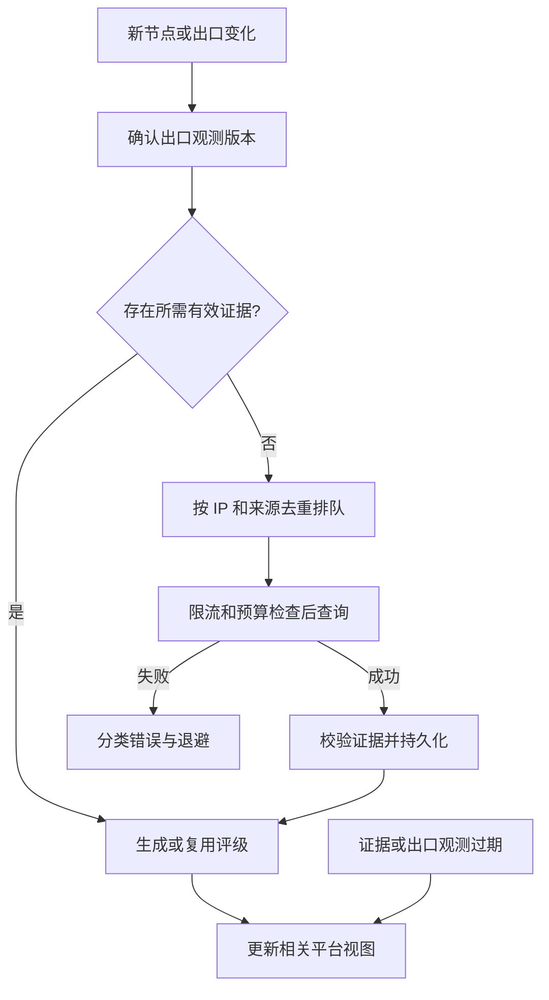

# 出口质量检测、标签与平台路由

状态：个人开源版设计草案。关联：[总设计](../DESIGN.md)、[安全](SECURITY.md)、[分组与规模](SCALE_AND_ROTATION.md)。

## 1. 对象与职责

| 对象 | 主键或作用域 | 记录内容 |
|---|---|---|
| Node | 配置 hash、配置 revision | 连接方式与订阅引用，保留 Resin 去重语义 |
| NodeRuntime | gateway + node + revision | Outbound、健康、延迟和本地连接状态 |
| EgressObservation | gateway + node + revision + IP family + probe profile | 观测出口、时间、观测版本、稳定性状态 |
| IPObservation | canonical IP + provider + 查询类型 + observation ID | 原始证据及其有效期 |
| QualityAssessment | canonical IP + profile version + assessment ID | 归并后的类型、评级、冲突与有效期 |
| TargetObservation | gateway + node + 出口观测版本 + target profile | 对指定目标的可达观测，不代表全局黑名单 |
| PlatformPolicy | platform + policy version | 标签、地区、质量和资源筛选规则 |

使用 `netip.Addr` 解析、规范化和存储 IP，IPv4-mapped IPv6 统一 `Unmap()`。IPv4 和独立 IPv6 出口分别检测，不能共用评级。删除节点可以保留有留存期限的 IP 历史证据；其他节点仍使用该 IP 时不得误删。

节点标签表示供应源命名或运营分类，不作为住宅、地区或信誉的证据。标签中的“住宅”字样不能替代检测结果。

## 2. 平台标签规则必须继承

Resin 的标签规则是本版一等功能，每个平台独立配置。现有字段 `regex_filters` 保留，迁移不得改变组合含义。依据：[规则编译](../../references/Resin/internal/platform/model_codec.go)、[节点匹配](../../references/Resin/internal/node/entry.go)。

候选字符串仍为 `<订阅名>/<原始 Tag>`。同节点可有多个订阅引用和多个 Tag，不能先拼成一条字符串再匹配。

| 规则 | 含义 |
|---|---|
| 普通正则 | ANY，普通规则之间 OR |
| 首字符 `*` | MUST，所有 MUST 必须命中 |
| 首字符 `!` | MUST_NOT，任一命中就排除整个节点 |

仅第一个字符作为前缀，剩余内容按 Go `regexp` 编译。兼容规则不擅自 trim 或改写正则。字面量开头字符通过转义或字符类表示；空正则按 Go 语义匹配所有字符串，界面必须明确预览其效果。

正向规则必须由同一个候选 Tag 同时满足：该 Tag 匹配全部 MUST，且 ANY 为空或至少命中一个 ANY。MUST_NOT 检查作用域内所有启用 Tag，不能因某个 Tag 已满足正向规则就跳过排除检查。

例子：

```json
{
  "regex_filters": [
    "^supplier-a/",
    "^supplier-b/",
    "*premium",
    "!trial"
  ]
}
```

此规则要求某个标签来自 supplier-a 或 supplier-b，且同一标签含 premium；只要另一条有效标签含 trial，整个节点就被排除。不能用 `supplier-a/basic` 满足供应商条件，再用 `supplier-c/premium` 满足 MUST。

没有正向规则时，要求存在至少一个作用域内启用订阅引用，同时没有命中排除规则。订阅被禁用、引用被驱逐或删除后，相应 Tag 不参与判断。

### 2.1 个人版资源范围

个人版管理员作用域覆盖本地配置中已启用的订阅。平台的 `regex_filters=[]` 表示不增加标签限制，但仍要求节点属于启用订阅、健康、出口和质量条件；它不会改变节点来源或绕过其他平台条件。

可以为节点增加独立的手动分类和展示别名，但不能覆盖原始订阅 Tag，也不能静默改变已有正则含义。订阅改名会改变 `<订阅名>/<Tag>` 候选字符串，必须预览受影响平台并触发更新。

### 2.2 规则优化

1. 保存时预编译，复用 Go RE2 语义，不引入支持灾难性回溯的正则引擎。
2. 每平台默认最多 64 条规则，每条最多 1024 UTF-8 字节；超限返回校验错误。迁移超限的旧平台标记待处理，禁止截断规则后放宽准入。
3. 初期继续用完整正确的匹配器；确定性前缀索引只缩小候选范围，最后仍执行完整规则。任意正则不能假装都可建立精确索引。
4. 缓存键包含节点引用版本、平台策略版本和手动分类版本；不能仅以 node hash 缓存跨平台匹配结果。
5. 订阅更新、改名、标签变更、启停、引用增减、驱逐和资源授权变化触发增量重算。
6. 提供预览、命中标签、排除原因和变更前后独立 IP 数量。预览有时效和规模上限，不保证保存后库存不变。

## 3. 质量证据与评级

质量包含网络类型、运营商与 ASN、代理特征、信誉和逐名单状态。网络类型枚举为 `residential`、`datacenter`、`mobile`、`unknown`、`conflicting`。代理或 VPN 标志单独存储，不把它们与网络类型压成一个互斥枚举。

每条证据包含：来源和来源版本、查询参数类别、观测 IP、`observed_at`、`received_at`、`valid_until`、原始分数或等级、标准化字段、状态、受限原始响应摘要。API key、请求认证头不得入库。

名单结果按 `list_id + category` 分别保存 `listed / clear / unknown / not_applicable`。`clear` 只表示该名单在该次有效查询下未命中；部分查询成功不能把其他未知名单填成 clear。

评级分三个层次：

1. 原始证据：忠实保存供应商值与含义，不统一假定高分安全。
2. 标准化风险或质量等级：由版本化、经样本验证的映射生成，不平均不同语义的分数。
3. 平台展示评级：可为精确值、区间或离散等级；只能在证据支持的分辨率下生成。

支持区间：`[0,60)`、`[60,80)`、`[80,90)`、`[90,95)`、`[95,100]`，数值越高代表按本规则判断越低风险。数据库保存 `score_low`、`score_high`、`upper_inclusive`、可空 `score_exact`，不只保存字符串。

这些区间是产品分类，不是统计置信区间或成功率。数据源只有高、中、低时先保存等级；完成映射校准后才输出数值区间。仅有 ASN/国家信息不能产生纯净度分数。

可信程度保存为 `high / medium / low / unknown`，并记录证据依据。首版支持一个主要来源与可选复核来源；来源矛盾记录 conflicting，严格策略排除。某来源命中严重名单不能被其他来源高分平均抵消。

`assessment.valid_until` 取本 profile 所需证据有效期的最早值。增加新来源不自动改变旧 profile 的准入结果；新 profile 版本经预览后发布。重新评级可复用未过期原始证据，不必重复付费查询。

## 4. 状态与调度

网络健康继续使用 Resin 的健康状态。质量状态独立为：`unobserved`、`pending`、`valid`、`stale`、`conflicting`、`unsupported`。任务错误另存，不覆盖最后一次成功证据。



### 4.1 触发和隔离

| 任务 | 触发 | 执行资源 |
|---|---|---|
| 健康、延迟 | 继承定时策略与被动反馈 | 健康专属 worker 和队列 |
| 出口发现 | 新节点、周期、配置变更、人工复测 | 出口/健康资源，有超时与响应大小限制 |
| IP 质量 | 新观测 IP、证据到期、人工复测 | inspection 专属 worker、供应商限额和费用预算 |
| 评级重算 | profile 版本变更、证据变化 | 无网络计算队列 |
| 视图刷新 | 标签、授权、评级、健康、时效变化 | 合并变更队列，不与查询 worker 相互等待 |

初始可调参数：质量 worker 8、任务队列 4096、单来源并发 2、请求超时 10 秒。实际 RPS 与每日预算必须按供应商合同配置；未配置费用上限不执行付费查询。健康 worker 和质量 worker 不共享额度。

信誉证据默认最大复用 24 小时，网络归属默认 7 天，均受来源有效期上限限制。严格平台出口观测默认最大 15 分钟；后台应在到期前刷新。以上是初始参数，不代表供应商保证或出口始终不变。

调度使用带抖动的到期队列或时间桶，避免一次唤醒扫描全部 IP。任务幂等键包含 `IP + provider + query_profile_version`；同一时刻合并同键任务。进行中的结果通过 attempt generation/CAS 发布，旧任务晚返回不能覆盖较新结果。

任务持久化 `next_run_at`、attempt、lease owner、lease expiry。进程重启回收过期任务，允许查询至少执行一次；对于超时但供应商可能已扣费的请求，记录成本不确定状态，不能保证外部请求恰好一次。手动复测仍受去重、权限和预算约束。

### 4.2 失败处理

| 情况 | 处理 |
|---|---|
| 429 | 尊重有上限的 Retry-After，并降低该来源速率 |
| 401/403 数据源认证失败 | 暂停该来源，告警，禁止频繁重试 |
| 超时/5xx | 指数退避加抖动，达到上限后等待下个周期 |
| 格式不符/IP 不一致 | 拒绝发布证据，记录解析错误；不标为低风险 |
| 来源不支持该 IP family | unsupported，不反复消耗配额 |
| 成本预算耗尽 | 延后任务，严格平台按证据到期淘汰 |
| 新出口出现时旧任务返回 | 可存旧 IP 证据，禁止附着到新出口版本 |

周期性 full reconciliation 校验任务与视图，弥补普通通知丢失；安全性依靠路由最终校验，不依赖该修复周期。

## 5. 平台准入语义

最终候选集合是以下条件的交集：

```text
平台配置允许的订阅和手动资源范围
  AND 启用订阅引用
  AND Resin 标签规则
  AND 网络健康及可用 Outbound
  AND 所需 IP family 与出口观测有效
  AND 地区/ASN 等筛选
  AND 平台质量条件及证据有效期
```

字段之间 AND；字段内允许集合通常 OR，排除集合优先。地区规则保持 Resin 的包含/排除语义。手动资源范围可以收紧平台范围，但不能取消健康、出口、质量和安全条件。

完整示例，UUID 为示例值：

```json
{
  "name": "US premium",
  "subscription_ids": ["0ac32073-314b-4c70-a060-342faaf76963"],
  "regex_filters": ["^supplier-a/", "*premium", "!trial"],
  "region_filters": ["us"],
  "quality_policy": {
    "profile_id": "reputation-standard-v1",
    "ip_types": ["residential"],
    "min_score": 90,
    "min_confidence": "medium",
    "required_clear_lists": ["abuse-primary"],
    "max_assessment_age_seconds": 86400,
    "max_egress_age_seconds": 900,
    "unknown_action": "exclude",
    "conflict_action": "exclude"
  },
  "allocation_policy": "BALANCED",
  "sticky_ttl_seconds": 1800
}
```

`min_score=90` 要求区间下界至少 90。范围跨越阈值时不能按中点或上界放行。缺少该字段所需证据就不满足条件。仅等级来源无法满足数值门槛，API 预览需要明确显示原因。

质量门槛在 P2C 之前执行。通过门槛后，P2C 继续比较可比延迟和出口负载，不将“纯净度”混入评分抵消硬限制。质量无关的平台可显式不启用质量条件，仍执行网络与授权约束。

## 6. 一致性与性能

节点运行态以不可变摘要一次发布：node revision、出口观测 generation、健康 generation、IP、质量引用。策略发布有 `policy_version`，资源授权有 `grant_version`。避免逐个修改 IP、评级、时间戳造成读到混合状态。

视图重建在后台完成，通过校验版本后原子切换。更新发布期间旧视图可用于枚举，但候选最终授权须验证当前策略、授权、出口与证据版本。严格策略变化后，未重建完成的候选先拒绝，不能继续按旧宽松条件转发。

普通质量和标签匹配在冷路径预计算。热路径只做固定数量快照读取、时间比较和版本检查；出现版本不符时限次重新选取，仍不符则返回暂不可用，不现场重算全部标签。

通过 `IP -> 节点引用`、`订阅 -> 节点引用` 定位变化。合并同一对象的重复通知，禁止每个质量字段更新都启动一轮全平台全量重建。

多个平台拥有完全相同的规范化策略和订阅范围时，可共享不可变候选视图；租约、优先级和换 IP 会话仍按平台隔离。不同订阅范围不能仅因为标签表达式相同就共享结果。

视图包含有界的同 IP 候选索引，使故障轮换优先按 IP 定位。首期允许沿用 Resin 冷路径扫描，但须测量其长尾；达到性能门槛前不能宣称所有选路分支 O(1)。

## 7. 粘性、失效和可解释性

租约保持 Resin 固定过期、不自动续期语义。命中租约、同 IP 轮换和新分配均检查当前候选资格。同 IP 轮换不改变租约原过期时间，重新分配出口才创建新租约。

评级下降或标签变化：停止新请求使用不合格节点；已有 TCP 会话默认允许在连接许可有效期内结束。严重封禁、凭证撤销、资源授权收回按安全策略主动关闭。无法在同一个已建立 TCP 隧道中无感切换出口。

“稳定出口”必须有供应商能力和持续观测支撑。对按目标、按连接或 IPv4/IPv6 变化的上游，不以单次 trace 结果承诺每次请求的实际出口。日志区分 `observed_egress_ip` 与可证实的实际出口，未知时不伪造。

预览输出：评估快照时间、策略版本、授权资源节点数、匹配节点数、独立 IP 数、是否完整、排除原因计数和少量样例。原因包括 `TAG_NOT_MATCHED`、`TAG_EXCLUDED`、`QUALITY_UNKNOWN`、`QUALITY_EXPIRED`、`IP_TYPE_MISMATCH`、`SCORE_BELOW_MIN`、`BLACKLIST_LISTED`、`EGRESS_STALE`。每原因可独立计数，多个原因重叠时总和不等于排除节点总数，API 明确注明。

代理数据面仅暴露通用错误和 request ID；管理接口可以返回当前管理员可见资源的排除原因。

## 8. 验收场景

- ANY/MUST/MUST_NOT 与 Resin 原规则一致；多标签正向条件不能跨标签拼接，负向规则检查全部有效 Tag。
- 空规则、空正则、转义前缀、禁用订阅、改名、驱逐和重复引用都有回归测试。
- 平台预览只返回当前配置中可见的订阅、标签和节点；空筛选不能突破本地资源范围。
- 同 IP 多节点只触发必要查询；IPv4 与 IPv6 不串用，节点换 IP 时旧结果不得覆盖。
- 来源失败、部分名单未知、评级冲突、证据到期时严格平台不误放行。
- 策略收紧和标签变化在并发路由、租约命中、视图重建期间仍遵守最新资格。
- 质量服务中断不阻塞健康探测与代理；队列和成本超限行为可观测且有界。
- 重启恢复不把 stale 证据变成 valid，不把旧未完成任务重复发布成最新结果。
